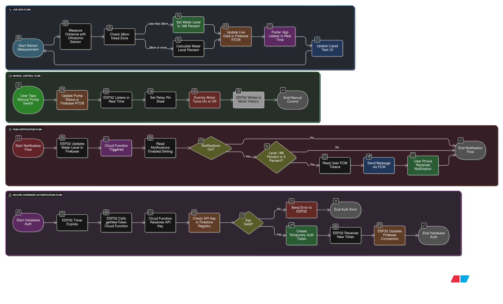

# Smart Water Tank - Full-Stack IoT Project 💧

This is a complete, production-ready IoT solution for monitoring and controlling a water tank from a Flutter mobile app. The system uses an ESP32 for hardware control and Firebase for all backend services.

---

## 🎥 Device and App Screenshots

*(Here are screenshots showing the app's main features)*

<table>
  <tr>
    <td></td>
    <td></td>
    <td></td>
  </tr>
  <tr>
    <td></td>
    <td></td>
    <td></td>
  </tr>
  <tr>
    <td></td>
    <td></td>
    <td></td>
  </tr>
</table>

---

## 🌟 Key Features

* **Real-time Monitoring:** Live water level percentage streamed directly to the app.
* **Dual-Mode Control:**
  * **Auto Mode:** Automatically turns the pump ON at 10% and OFF at 95%.
  * **Manual Mode:** Toggle the pump from the app at any time.
* **Push Notifications:** Instant alerts for "Tank Full" and "Tank Empty" sent via FCM, even when the app is closed.
* **Full User Control:**
  * Enable or disable all notifications from the app's settings.
  * Set the specific height of your tank for accurate percentage calculations.
* **History:** A full, time-stamped log of all motor "ON" and "OFF" events and tank level history.
* **Secure Authentication:** 3-level security (Hardware API Key, User Login, and Database Rules) to ensure data is safe.
* **Easy Setup:** Uses BLE for initial WiFi and API Key provisioning.

---

## 🛠️ Tech Stack & Architecture

This project is built on a full-stack architecture, from hardware to the cloud and the mobile app.

### **Tech Stack**

* **Mobile App:** Flutter & Dart
* **Backend:** Firebase Realtime Database, Firebase Cloud Functions (Node.js)
* **Hardware:** ESP32, Ultrasonic Sensor (HC-SR04), 5V Relay, OLED Display
* **Authentication:** Firebase Auth (for users) & Cloud Firestore (for device API key registry)

### **System Architecture**

*(This flowchart shows the complete data flow for the project)*

### **Hardware Wiring Diagram**

*(This diagram shows the connections for the ESP32, sensor, relay, and display)*

---

## 🤝 Development & Tools

This project was built by me, with the assistance of Google's Gemini (an AI coding partner).

I used Gemini to:
* Help generate boilerplate code for Flutter, the ESP32, and Cloud Functions.
* Architect the secure, token-based authentication system.
* Rapidly debug complex issues in the firmware, app state management, and cloud functions.

All project requirements, system design, hardware integration, final testing, and documentation were managed and executed by me. Using an AI assistant allowed me to build and iterate on this full-stack project much more efficiently.

---

## ⚠️ How to Set Up (Configuration)

This project uses dummy data for all API keys. To run it, you must use your own Firebase project and keys.

### 1. Flutter App
You must add your own Firebase configuration to `/smart_water_tank/lib/firebase_options.dart`.

### 2. ESP32 Firmware
You must add your own keys and URLs to the `/esp32_firmware/smart_water_tank.ino` file:
* `FIREBASE_API_KEY`
* `FIREBASE_DATABASE_URL`
* `tokenFunctionUrl` (Your `getNewToken` Cloud Function URL)

### 3. Cloud Functions
Deploy the functions in the `/smart_water_tank/functions` folder to your own Firebase project using the Firebase CLI.

### 4. Firebase Rules
You must add the secure database rules to your Firebase project:
* Copy the rules from `/database.rules.json` and paste them into the **Realtime Database** rules editor in your Firebase console.
* Copy the rules from `/firestore.rules` and paste them into the **Firestore Database** rules editor in your Firebase console.

---
